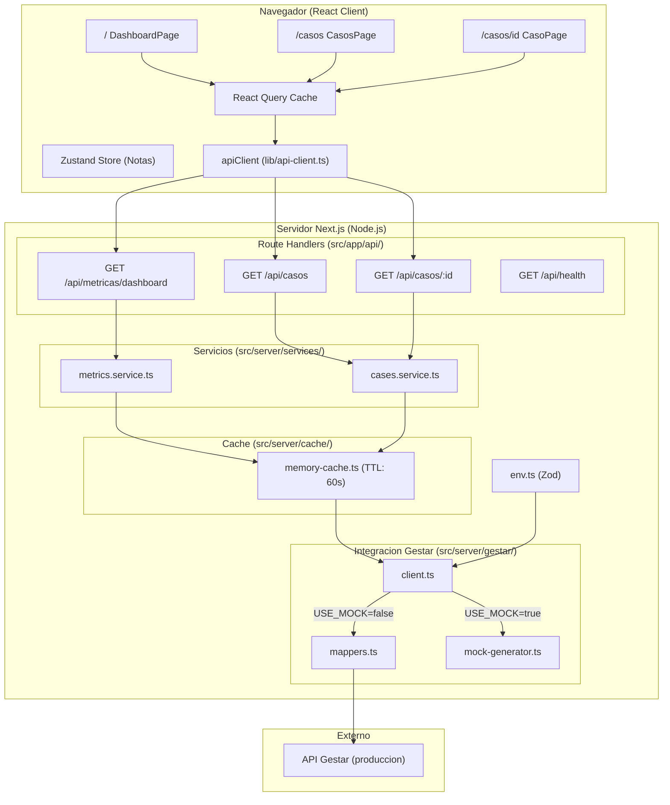
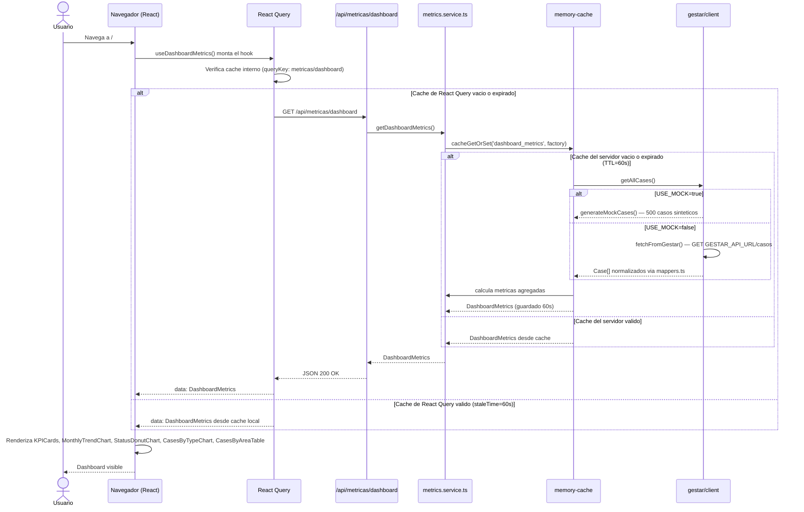
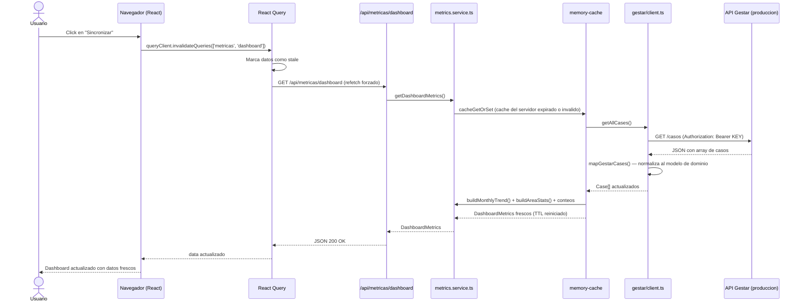
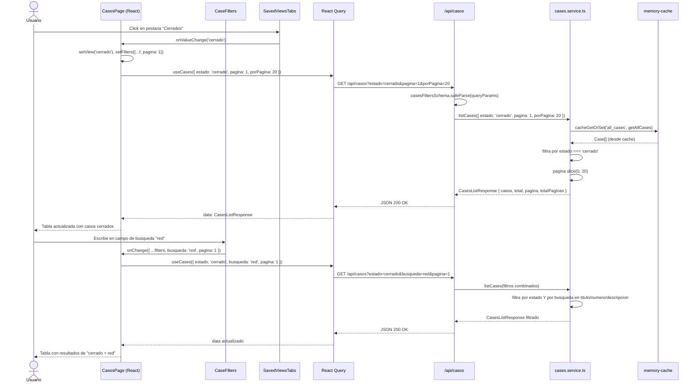

# Documentacion Tecnica — Dashboard Microinformatica BCC

> **Proyecto:** Dashboard de Incidentes IT — Microinformatica
> **Organizacion:** Banco de Cordoba (BCC)
> **Version del documento:** 1.0
> **Fecha:** Mayo 2026

---

## Tabla de Contenidos

1. [Descripcion General del Proyecto](#1-descripcion-general-del-proyecto)
2. [Stack Tecnologico](#2-stack-tecnologico)
3. [Arquitectura del Sistema](#3-arquitectura-del-sistema)
4. [Estructura de Archivos y Directorios](#4-estructura-de-archivos-y-directorios)
5. [Componentes y Modulos](#5-componentes-y-modulos)
6. [Metricas y KPIs del Dashboard](#6-metricas-y-kpis-del-dashboard)
7. [Diagramas de Secuencia](#7-diagramas-de-secuencia)
8. [Modelo de Datos](#8-modelo-de-datos)
9. [Configuracion y Variables de Entorno](#9-configuracion-y-variables-de-entorno)
10. [Decisiones de Diseno y Restricciones](#10-decisiones-de-diseno-y-restricciones)
11. [Roadmap de Fases](#11-roadmap-de-fases)
12. [Guia de Contribucion y Desarrollo Futuro](#12-guia-de-contribucion-y-desarrollo-futuro)

---

## 1. Descripcion General del Proyecto

### Nombre del Proyecto

**Dashboard Microinformatica — Banco de Cordoba (BCC)**

Identificador interno del servicio: `dashboard-microinformatica-bcc`

### Proposito y Contexto de Negocio

El area de Microinformatica del Banco de Cordoba gestiona cotidianamente cientos de casos de soporte IT — incidentes, solicitudes, problemas y cambios — registrados en el sistema de gestion **Gestar**. Sin embargo, no existia hasta ahora una herramienta de visualizacion centralizada que permitiera a la gerencia de tecnologia obtener una lectura rapida del estado operativo del area.

Este proyecto construye ese panel de control: un **dashboard web interno** que consolida las metricas operativas clave de los casos de soporte, exponiendolas en graficos interactivos y tablas actualizadas. El objetivo inmediato es habilitar la toma de decisiones basada en datos y facilitar la comunicacion del estado del area hacia la direccion del banco.

### Audiencia Objetivo

El dashboard esta disenado principalmente para:

- **Gerencia de Tecnologia del Banco de Cordoba:** supervision del rendimiento operativo del area de Microinformatica.
- **Jefatura de Microinformatica:** seguimiento de carga de trabajo, SLAs y distribucion de casos por area y tecnico.
- **Analistas y tecnicos IT (uso secundario):** acceso al listado de casos filtrables y detalle individual de cada caso.

### Estado Actual del Proyecto

El proyecto se encuentra en **fase de mockup funcional**. La aplicacion esta completamente construida e integrada pero opera sobre datos generados sinteticamente (500 casos deterministicos para el ejercicio 2025). La conexion real con la API de Gestar esta disenada e implementada en el codigo, pero requiere autorizacion formal interna y la documentacion de los endpoints del sistema para activarse.

**Modo actual:** `USE_MOCK=true` (valor por defecto)

---

## 2. Stack Tecnologico

### Dependencias de Produccion

| Tecnologia | Version | Rol en el Proyecto |
|---|---|---|
| **Next.js** | `16.2.6` | Framework fullstack (App Router). Provee SSR, Route Handlers (API), sistema de rutas y optimizacion de fuentes. |
| **React** | `19.2.4` | Libreria de UI. Base de todos los componentes del frontend. |
| **React DOM** | `19.2.4` | Renderizado de React en el navegador. |
| **TypeScript** | `^5` | Tipado estatico. Garantiza la integridad del modelo de datos a lo largo de toda la aplicacion. |
| **TailwindCSS** | `^4` | Framework CSS utility-first. Toda la interfaz se estila con clases de Tailwind. |
| **@tanstack/react-query** | `^5.100.9` | Gestion del estado del servidor (cache, refetch, loading states). Usado en todos los hooks de datos del cliente. |
| **@tanstack/react-table** | `^8.21.3` | Tabla de datos con ordenamiento para el listado de casos. |
| **recharts** | `^3.8.1` | Libreria de graficos SVG basada en React. Usada para el grafico de tendencia mensual (LineChart), distribucion por estado (PieChart) y casos por tipo (BarChart). |
| **zustand** | `^5.0.13` | Gestion de estado global en el cliente. Utilizado para el store de notas de casos. |
| **zod** | `^4.4.3` | Validacion y parsing de esquemas. Valida variables de entorno, parametros de API y filtros. |
| **date-fns** | `^4.1.0` | Utilidades de formateo y manipulacion de fechas con soporte de locale espanol (`es`). |
| **lucide-react** | `^1.14.0` | Libreria de iconos SVG. Usada en toda la interfaz. |
| **clsx** | `^2.1.1` | Construccion condicional de clases CSS. |
| **tailwind-merge** | `^3.5.0` | Resolucion de conflictos entre clases de Tailwind al combinarlas. |
| **class-variance-authority** | `^0.7.1` | Definicion de variantes tipadas para componentes UI (Badge, Button). |

### Dependencias de Desarrollo

| Tecnologia | Version | Rol |
|---|---|---|
| **@tailwindcss/postcss** | `^4` | Plugin PostCSS para compilar Tailwind v4. |
| **@tanstack/react-query-devtools** | `^5.100.9` | Panel de desarrollo para inspeccionar el cache de React Query en el navegador. |
| **@types/node** | `^20` | Tipos TypeScript para el entorno Node.js. |
| **@types/react** | `^19` | Tipos TypeScript para React. |
| **@types/react-dom** | `^19` | Tipos TypeScript para React DOM. |
| **eslint** | `^9` | Linter de codigo JavaScript/TypeScript. |
| **eslint-config-next** | `16.2.6` | Configuracion de ESLint recomendada por Next.js. |

### Justificacion de las Elecciones Tecnologicas

- **Next.js App Router:** permite colocar la logica de acceso a datos (cliente Gestar, cache, servicios) en el servidor, evitando exponer la API key al navegador. Las Route Handlers actuan como una capa BFF (Backend for Frontend).
- **React Query:** simplifica dramaticamente el manejo de loading/error/stale states sin necesidad de Redux u otro store complejo para datos remotos.
- **Recharts:** maduro, bien documentado y con soporte nativo de componentes React. Adecuado para dashboards de gestion con volumen moderado de datos.
- **Zod:** la validacion en el borde (variables de entorno y parametros de query) previene errores en tiempo de ejecucion que podrian ser dificiles de diagnosticar.
- **Zustand:** store minimalista para el estado efimero del cliente (notas de casos) sin la complejidad de Redux.
- **date-fns con locale `es`:** los meses y fechas relativas se muestran en espanol argentino, coherente con la audiencia del banco.

---

## 3. Arquitectura del Sistema

### Descripcion General

El sistema sigue una arquitectura **fullstack monolitica** basada en Next.js, donde el mismo proceso Node.js sirve tanto la interfaz web como la API interna. No hay un backend separado; las Route Handlers de Next.js implementan una capa de API REST minima que consume el sistema Gestar o el generador de datos de prueba.

```
Navegador (React) <---> Route Handlers Next.js <---> API Gestar (produccion)
                                                  |
                                                  `--> Mock Generator (desarrollo)
```

### Separacion de Responsabilidades

| Capa | Ubicacion | Responsabilidad |
|---|---|---|
| **Presentacion** | `src/app/` (paginas), `src/components/`, `src/features/*/components/` | Renderizado de la interfaz, interaccion del usuario. |
| **Estado del cliente** | `src/features/*/hooks/`, `src/lib/query-client.ts` | Cache de datos remotos via React Query; estado efimero via Zustand. |
| **API interna** | `src/app/api/` | Route Handlers que exponen endpoints REST al frontend. |
| **Servicios del servidor** | `src/server/services/` | Logica de negocio: filtrado, paginacion, calculo de metricas. |
| **Integracion Gestar** | `src/server/gestar/` | Cliente HTTP, mappers de datos y generador de mocks. |
| **Infraestructura** | `src/server/cache/`, `src/server/env.ts`, `src/server/errors.ts` | Cache en memoria, validacion de entorno, jerarquia de errores. |
| **Tipos y contratos** | `src/types/domain.ts`, `src/server/gestar/schemas.ts` | Modelo de dominio compartido y esquemas Zod. |
| **Utilidades** | `src/lib/` | Formatters, cliente fetch, utilidades de clases CSS. |

### Diagrama de Arquitectura



### Descripcion de la Fuente de Datos (Sistema Gestar)

**Gestar** es el sistema de gestion de servicios IT utilizado internamente por el Banco de Cordoba. Es la fuente de verdad de todos los casos (incidentes, solicitudes, problemas y cambios) del area de Microinformatica.

La integracion esta disenada para consumir un endpoint REST del tipo:

```
GET ${GESTAR_API_URL}/casos
Authorization: Bearer ${GESTAR_API_KEY}
```

La respuesta esperada es un objeto JSON con una propiedad `casos` (array) o directamente el array. Los datos crudos son normalizados al modelo de dominio interno a traves de `mappers.ts`.

> **Estado actual:** En desarrollo/mockup. La variable `USE_MOCK=true` redirige todas las consultas al generador sintetico en lugar de la API real.

---

## 4. Estructura de Archivos y Directorios

```
app/
|-- src/
|   |-- app/                          # Rutas y paginas (Next.js App Router)
|   |   |-- layout.tsx                # Layout raiz: fuentes, providers, sidebar
|   |   |-- page.tsx                  # Pagina principal: Dashboard (/)
|   |   |-- globals.css               # Variables CSS globales y tema de color
|   |   |-- favicon.ico               # Icono de la aplicacion
|   |   |-- casos/
|   |   |   |-- page.tsx              # Pagina de listado de casos (/casos)
|   |   |   `-- [id]/
|   |   |       `-- page.tsx          # Pagina de detalle de caso (/casos/:id)
|   |   `-- api/
|   |       |-- health/
|   |       |   `-- route.ts          # GET /api/health — healthcheck
|   |       |-- casos/
|   |       |   |-- route.ts          # GET /api/casos — listado paginado y filtrable
|   |       |   `-- [id]/
|   |       |       `-- route.ts      # GET /api/casos/:id — detalle de caso
|   |       `-- metricas/
|   |           `-- dashboard/
|   |               `-- route.ts      # GET /api/metricas/dashboard — metricas agregadas
|   |
|   |-- components/                   # Componentes reutilizables globales
|   |   |-- providers.tsx             # QueryClientProvider + ReactQueryDevtools
|   |   |-- layout/
|   |   |   |-- Sidebar.tsx           # Navegacion lateral fija
|   |   |   |-- Header.tsx            # Encabezado de pagina con titulo y acciones
|   |   |   `-- Breadcrumbs.tsx       # Componente de migas de pan (definido, uso futuro)
|   |   `-- ui/                       # Primitivos de interfaz (design system propio)
|   |       |-- badge.tsx             # Badge/etiqueta con variantes de color
|   |       |-- button.tsx            # Boton con variantes y tamanos
|   |       |-- card.tsx              # Tarjeta contenedora con sub-componentes
|   |       |-- input.tsx             # Campo de texto
|   |       |-- separator.tsx         # Separador visual
|   |       `-- tabs.tsx              # Sistema de pestanas (implementacion propia)
|   |
|   |-- features/                     # Modulos por funcionalidad de negocio
|   |   |-- dashboard/
|   |   |   |-- components/
|   |   |   |   |-- KPICards.tsx          # Tarjetas de metricas clave (7 KPIs)
|   |   |   |   |-- MonthlyTrendChart.tsx # Grafico de linea: tendencia mensual
|   |   |   |   |-- StatusDonutChart.tsx  # Grafico de dona: distribucion por estado
|   |   |   |   |-- CasesByTypeChart.tsx  # Grafico de barras horizontales: por tipo
|   |   |   |   `-- CasesByAreaTable.tsx  # Tabla: casos por area con tasa de cierre
|   |   |   `-- hooks/
|   |   |       `-- useDashboardMetrics.ts # Hook React Query para metricas
|   |   |-- cases/
|   |   |   |-- components/
|   |   |   |   |-- CasesTable.tsx        # Tabla de casos con ordenamiento (TanStack Table)
|   |   |   |   |-- CaseFilters.tsx       # Barra de filtros (busqueda, prioridad, tipo)
|   |   |   |   |-- CasesStatsBar.tsx     # Contador "Mostrando X de Y casos"
|   |   |   |   |-- SavedViewsTabs.tsx    # Pestanas de vistas rapidas por estado
|   |   |   |   |-- CaseDetailHeader.tsx  # Encabezado del detalle de caso
|   |   |   |   `-- CaseInfoTabs.tsx      # Pestanas Detalles / Notas del caso
|   |   |   `-- hooks/
|   |   |       |-- useCases.ts           # Hook React Query para listado de casos
|   |   |       `-- useCase.ts            # Hook React Query para caso individual
|   |   `-- notes/
|   |       |-- store.ts              # Store Zustand para notas de casos (en memoria)
|   |       `-- hooks.ts              # Hook useNotes que encapsula el store
|   |
|   |-- server/                       # Codigo exclusivo del servidor (no se envia al browser)
|   |   |-- env.ts                    # Validacion de variables de entorno con Zod
|   |   |-- errors.ts                 # Jerarquia de errores (AppError, NotFoundError, ValidationError)
|   |   |-- cache/
|   |   |   `-- memory-cache.ts       # Cache en memoria con TTL configurable
|   |   |-- gestar/
|   |   |   |-- client.ts             # Punto de entrada: mock o API real segun USE_MOCK
|   |   |   |-- mappers.ts            # Transformacion de respuesta Gestar -> dominio interno
|   |   |   |-- mock-generator.ts     # Generador deterministico de 500 casos sinteticos
|   |   |   `-- schemas.ts            # Esquemas Zod para validar filtros y entidades
|   |   `-- services/
|   |       |-- cases.service.ts      # Logica de filtrado, busqueda y paginacion de casos
|   |       `-- metrics.service.ts    # Calculo de metricas agregadas para el dashboard
|   |
|   |-- lib/                          # Utilidades del cliente
|   |   |-- api-client.ts             # Cliente fetch tipado para las APIs internas
|   |   |-- query-client.ts           # Configuracion del QueryClient de React Query
|   |   |-- formatters.ts             # Funciones de formato de fecha, numero y porcentaje
|   |   `-- utils.ts                  # Funcion cn() para composicion de clases CSS
|   |
|   `-- types/
|       `-- domain.ts                 # Interfaces y tipos TypeScript del dominio
|
|-- public/                           # Archivos estaticos publicos
|-- next.config.ts                    # Configuracion de Next.js
|-- tsconfig.json                     # Configuracion de TypeScript
|-- postcss.config.mjs                # Configuracion de PostCSS (Tailwind v4)
|-- eslint.config.mjs                 # Configuracion de ESLint
|-- package.json                      # Dependencias y scripts del proyecto
`-- Documentacion.md                  # Este documento
```

### Proposito de los Directorios Principales

| Directorio | Proposito |
|---|---|
| `src/app/` | Enrutamiento de Next.js. Cada carpeta es una ruta; `route.ts` define endpoints de API; `page.tsx` define paginas de interfaz. |
| `src/components/` | Componentes de uso global: layout de la aplicacion y primitivos de UI reutilizables en cualquier feature. |
| `src/features/` | Organizacion por dominio funcional (dashboard, cases, notes). Cada feature agrupa sus propios componentes, hooks y stores. |
| `src/server/` | Codigo que solo puede ejecutarse en el servidor de Node.js. Incluye acceso a variables de entorno sensibles (API key). Next.js garantiza que no se incluya en el bundle del cliente. |
| `src/lib/` | Utilidades genericas del lado cliente: cliente HTTP, configuracion de React Query y funciones de formato. |
| `src/types/` | Definiciones de tipos e interfaces TypeScript compartidas entre cliente y servidor. |

---

## 5. Componentes y Modulos

### 5.1 Layout

#### `Sidebar` (`src/components/layout/Sidebar.tsx`)

Barra de navegacion lateral fija de 240px de ancho. Muestra el logo "M" de Microinformatica con el subtitulo "Banco de Cordoba", los items de navegacion principal y un link a Configuracion en el pie.

**Comportamiento:** Resalta el item activo comparando la ruta actual (`usePathname()`) con el `href` de cada item. La coincidencia de la raiz (`/`) es exacta; las demas rutas usan `startsWith`.

**Items de navegacion:**

| Ruta | Label | Icono |
|---|---|---|
| `/` | Dashboard | `LayoutDashboard` |
| `/casos` | Casos | `Ticket` |
| `/configuracion` | Configuracion | `Settings` |

---

#### `Header` (`src/components/layout/Header.tsx`)

Encabezado de pagina con 64px de altura. Muestra titulo, subtitulo opcional y un slot de acciones personalizable. Siempre incluye el indicador "Datos en tiempo real" (icono `RefreshCw`).

**Props:**
```typescript
interface HeaderProps {
  title: string;
  subtitle?: string;
  actions?: React.ReactNode;
}
```

---

#### `Breadcrumbs` (`src/components/layout/Breadcrumbs.tsx`)

Componente de navegacion de migas de pan. Renderiza una lista de `Crumb` separados por `ChevronRight`. El ultimo elemento no es un enlace.

**Props:**
```typescript
interface BreadcrumbsProps {
  crumbs: Crumb[]; // { label: string; href?: string }[]
}
```

> Nota: El componente esta implementado pero no se utiliza actualmente en ninguna pagina. Esta disponible para uso futuro.

---

### 5.2 Primitivos UI (`src/components/ui/`)

#### `Badge`

Etiqueta de estado con variantes de color. Construida con `class-variance-authority`.

**Variantes:**

| Variant | Color de fondo | Uso tipico |
|---|---|---|
| `default` | `#0F4C3A` (verde BCC) | General |
| `secondary` | Gris claro | Estados neutros (derivado, suspendido) |
| `outline` | Borde gris | Prioridad baja |
| `destructive` | `#C53030` (rojo) | Prioridad critica, SLA vencido |
| `warning` | `#D97706` (amarillo) | Prioridad alta, devuelto al usuario |
| `success` | `#6B8E5A` (verde claro) | Estado cerrado, SLA OK |
| `info` | `#2563A6` (azul) | Estado atendido |

---

#### `Button`

Boton accesible con variantes de estilo y tamano.

**Variantes:** `default`, `outline`, `ghost`, `link`, `destructive`
**Tamanos:** `default` (h-9), `sm` (h-8), `lg` (h-10), `icon` (h-9 w-9)

---

#### `Card` / `CardHeader` / `CardTitle` / `CardContent` / `CardFooter`

Contenedor de tarjeta con borde redondeado, sombra y subcomponentes para estructurar el contenido. Todos usan `React.forwardRef`.

---

#### `Tabs` / `TabsList` / `TabsTrigger` / `TabsContent`

Sistema de pestanas implementado desde cero usando `React.createContext`. No depende de librerias externas como Radix UI. La pestana activa se determina por el valor de contexto; `TabsContent` retorna `null` cuando no esta activa.

---

#### `Input`

Campo de texto HTML nativo estilado con Tailwind.

---

### 5.3 Feature: Dashboard

#### `KPICards` (`src/features/dashboard/components/KPICards.tsx`)

Muestra 7 tarjetas KPI en una grilla responsiva (1 columna en mobile, 2 en tablet, 4 en desktop).

**Props:** `{ metrics: DashboardMetrics }`

**Tarjetas renderizadas:**

| Label | Dato | Color de borde |
|---|---|---|
| Total Casos | `metrics.totalCasos` | `#2563A6` (azul) |
| Atendidos | `metrics.casosAtendidos` | `#D97548` (naranja) |
| Cerrados | `metrics.casosCerrados` | `#D97545` (naranja oscuro) |
| Derivados | `metrics.casosDerivados` | `#6B8E5A` (verde claro) |
| Derivados a Proveedores | `metrics.casosDerivadosAProveedores` | `#6B8E5A` |
| Devueltos al Usuario | `metrics.casosDevueltosAlUsuario` | `#C53030` (rojo) |
| Suspendidos | `metrics.casosSuspendidos` | `#6B8E5A` |

---

#### `MonthlyTrendChart` (`src/features/dashboard/components/MonthlyTrendChart.tsx`)

Grafico de linea (recharts `LineChart`) que muestra la evolucion mensual de casos recibidos y cerrados en los ultimos 12 meses.

**Props:** `{ data: MonthlyData[] }`

**Series:**
- `recibidos` — linea azul `#2563A6`
- `cerrados` — linea verde `#6B8E5A`

**Altura del grafico:** 280px

---

#### `StatusDonutChart` (`src/features/dashboard/components/StatusDonutChart.tsx`)

Grafico de dona (recharts `PieChart` con `innerRadius=65, outerRadius=95`) que muestra la distribucion porcentual de casos por estado. En el centro se renderiza el total de casos sobre la etiqueta "casos".

**Props:** `{ data: StatusCount[], total: number }`

**Paleta de colores por estado:**

| Estado | Color |
|---|---|
| atendido | `#D97548` |
| cerrado | `#D97706` |
| derivado | `#6B8E5A` |
| derivado a proveedor | `#9CA3AF` |
| devuelto al usuario | `#4B5563` |
| suspendido | `#374151` |

---

#### `CasesByTypeChart` (`src/features/dashboard/components/CasesByTypeChart.tsx`)

Grafico de barras horizontales (recharts `BarChart` con `layout="vertical"`) que compara el volumen de casos por tipo.

**Props:** `{ data: TypeCount[] }`

**Colores por tipo:**

| Tipo | Color |
|---|---|
| Incidente | `#D97548` (naranja) |
| Solicitud | `#2563A6` (azul) |
| Problema | `#C53030` (rojo) |
| Cambio | `#6B8E5A` (verde) |

---

#### `CasesByAreaTable` (`src/features/dashboard/components/CasesByAreaTable.tsx`)

Tabla HTML que lista las areas del banco ordenadas por volumen de casos, mostrando total, cantidad cerrada y tasa de cierre. La tasa de cierre se codifica con colores via `Badge`:

- `>= 70%` → `success` (verde)
- `>= 40%` → `warning` (amarillo)
- `< 40%` → `destructive` (rojo)

**Props:** `{ data: AreaStats[] }`

---

#### `useDashboardMetrics` (`src/features/dashboard/hooks/useDashboardMetrics.ts`)

Hook de React Query que consume `GET /api/metricas/dashboard`.

- **Query key:** `['metricas', 'dashboard']`
- **staleTime:** 60 segundos
- **Retorna:** `{ data: DashboardMetrics | undefined, isLoading, error }`

---

### 5.4 Feature: Casos

#### `CasesTable` (`src/features/cases/components/CasesTable.tsx`)

Tabla de datos construida con `@tanstack/react-table`. Soporta ordenamiento por columna mediante click en el encabezado.

**Columnas:** Numero (link al detalle), Titulo, Estado (Badge), Prioridad (Badge), Area, Asignado a, Creado (formatDate), SLA (Badge Vencido/OK).

**Props:** `{ data: Case[] }`

---

#### `CaseFilters` (`src/features/cases/components/CaseFilters.tsx`)

Barra de filtros compuesta por: campo de busqueda libre (filtra por titulo, numero y descripcion), selector de prioridad y selector de tipo. Incluye boton "Limpiar" que se muestra cuando hay algun filtro activo. Cada cambio resetea la paginacion a la pagina 1.

**Props:**
```typescript
interface CaseFiltersProps {
  filters: CasesFilters;
  onChange: (filters: CasesFilters) => void;
}
```

---

#### `SavedViewsTabs` (`src/features/cases/components/SavedViewsTabs.tsx`)

Pestanas de acceso rapido que filtran los casos por estado. Las vistas disponibles son: Todos, Atendidos, Cerrados, Derivados, Derivados a Proveedor, Devueltos al Usuario, Suspendidos.

**Props:** `{ value: string, onValueChange: (v: string) => void }`

---

#### `CasesStatsBar` (`src/features/cases/components/CasesStatsBar.tsx`)

Indicador textual "Mostrando X de Y casos". Props: `{ total: number, showing: number }`.

---

#### `CaseDetailHeader` (`src/features/cases/components/CaseDetailHeader.tsx`)

Encabezado de la pagina de detalle. Muestra numero de caso, badges de estado y prioridad, indicador de SLA vencido si aplica, titulo del caso, y una grilla de metadatos (area, asignado a, fecha de creacion, fecha SLA). Incluye boton "Volver a casos".

**Props:** `{ caso: Case }`

---

#### `CaseInfoTabs` (`src/features/cases/components/CaseInfoTabs.tsx`)

Sistema de dos pestanas para el detalle del caso:

- **Detalles:** descripcion completa, tipo, categoria, fecha de ultima actualizacion y fecha de cierre (si aplica).
- **Notas:** lista de notas agregadas localmente (via Zustand) con textarea para agregar nuevas. El contador de notas se muestra en la pestana.

**Props:** `{ caso: Case }`

---

#### `useCases` / `useCase`

- `useCases(filters)`: React Query — `GET /api/casos` con query string de filtros. **staleTime:** 30s. **Query key:** `['casos', filters]`.
- `useCase(id)`: React Query — `GET /api/casos/:id`. **staleTime:** 30s. **Query key:** `['casos', id]`. Solo ejecuta cuando `id` es truthy.

---

### 5.5 Feature: Notas

#### `useNotesStore` (`src/features/notes/store.ts`)

Store Zustand para notas de casos. Las notas son **efimeras** (se pierden al recargar la pagina). Cada nota tiene `id` (timestamp), `caseId`, `texto`, `autor` (fijo: "Usuario actual") y `creadoEn`.

**Metodos:** `addNote(caseId, texto)`, `getNotesByCaseId(caseId)`.

#### `useNotes(caseId)` (`src/features/notes/hooks.ts`)

Wrapper del store que devuelve las notas del caso especificado y una funcion `addNote(texto)` curried con el `caseId`.

---

### 5.6 Infraestructura del Servidor

#### `memory-cache.ts`

Cache en memoria basado en `Map`. Implementa `cacheGet<T>`, `cacheSet<T>` y `cacheGetOrSet<T>` (pattern cache-aside). El TTL es configurable via variable de entorno `CACHE_TTL_MS` (por defecto 60.000 ms). Las claves utilizadas en la aplicacion son `'all_cases'` y `'dashboard_metrics'`.

#### `errors.ts`

Jerarquia de errores tipados:
- `AppError(message, code, statusCode)` — error base
- `NotFoundError(resource, id)` — HTTP 404
- `ValidationError(message)` — HTTP 400

#### `env.ts`

Valida y exporta las variables de entorno al inicio del proceso. Si alguna variable es invalida, el servidor arroja un error explicito en lugar de fallar silenciosamente mas tarde.

---

## 6. Metricas y KPIs del Dashboard

### Categoria 1: Totales de Casos (KPI Cards)

Metricas de alto nivel extraidas de `DashboardMetrics`:

| KPI | Descripcion |
|---|---|
| **Total Casos** | Cantidad total de casos en el sistema para el periodo analizado. |
| **Atendidos** | Casos en estado `atendido` (en proceso de atencion por el tecnico). |
| **Cerrados** | Casos en estado `cerrado` (resolucion completada). |
| **Derivados** | Casos derivados a otro equipo interno. |
| **Derivados a Proveedores** | Casos escalados a proveedores externos. |
| **Devueltos al Usuario** | Casos devueltos al solicitante por falta de informacion u otras causas. |
| **Suspendidos** | Casos pausados temporalmente. |

> La metrica `slaVencidos` esta calculada en el servicio pero no se incluye actualmente en las KPI Cards. Esta disponible en el objeto `DashboardMetrics` para uso futuro.

### Categoria 2: Casos por Tipo (`CasesByTypeChart`)

Distribucion del volumen de casos segun su clasificacion:

| Tipo | Descripcion |
|---|---|
| **Incidente** | Interrupcion o degradacion de un servicio IT. |
| **Solicitud** | Pedido de un nuevo servicio, acceso o instalacion. |
| **Problema** | Causa raiz de uno o mas incidentes recurrentes. |
| **Cambio** | Modificacion planificada de la infraestructura o sistemas. |

### Categoria 3: Casos por Estado y Area (`StatusDonutChart` + `CasesByAreaTable`)

- **StatusDonutChart:** proporcion de cada estado sobre el total de casos del periodo.
- **CasesByAreaTable:** para cada area del banco, muestra el total de casos, la cantidad cerrada y la **tasa de cierre** (porcentaje de casos resueltos). Las areas se ordenan de mayor a menor volumen.

### Categoria 4: Tendencia Mensual (`MonthlyTrendChart`)

Evolucion mes a mes (ultimos 12 meses) de:
- **Recibidos:** casos creados en ese mes (agrupados por `creadoEn`).
- **Cerrados:** casos cuyo campo `cerradoEn` corresponde a ese mes.

Permite identificar si el area esta absorbiendo la demanda o acumulando backlog.

---

### Datos del Generador de Mockup

El generador (`mock-generator.ts`) produce **500 casos deterministicos** usando el algoritmo `mulberry32` con semilla `42`, correspondientes al ejercicio **2025** (01/01/2025 — 31/12/2025).

**Distribuciones aplicadas:**

| Dimension | Distribucion |
|---|---|
| **Tipo** | Incidente 50% / Solicitud 30% / Problema 12% / Cambio 8% |
| **Estado** | Atendido 20% / Cerrado 25% / Derivado 25% / Derivado a Proveedor 15% / Devuelto al Usuario 10% / Suspendido 5% |
| **Prioridad** | Baja 30% / Media 40% / Alta 22% / Critica 8% |

**Areas representadas:** Contabilidad, Creditos, Sistemas, Recursos Humanos, Compliance, Tesoreria, Atencion al Cliente, Operaciones, Legales, Auditoria.

**Categorias de casos:** Hardware, Software, Red, Accesos, Correo, Impresoras, Telefonia, Backup, Seguridad, Base de Datos.

**Tecnicos asignados:** Garcia M., Lopez J., Martinez R., Rodriguez A., Fernandez P., Gonzalez L., Perez C., Sanchez D.

**SLA por prioridad:**

| Prioridad | Dias habiles de SLA |
|---|---|
| Critica | 1 dia |
| Alta | 4 dias |
| Media | 8 dias |
| Baja | 16 dias |

**Numeracion de casos:** Los casos se numeran con prefijo segun tipo (`INC-2025-XXXX`, `SOL-2025-XXXX`, `PRB-2025-XXXX`, `CAM-2025-XXXX`).

### Conexion con la API de Gestar en Produccion

Cuando `USE_MOCK=false`, el flujo es el siguiente:

1. `cases.service.ts` / `metrics.service.ts` consultan el cache con clave `'all_cases'` o `'dashboard_metrics'`.
2. Si no hay cache valido, invocan `getAllCases()` en `gestar/client.ts`.
3. `client.ts` realiza `GET ${GESTAR_API_URL}/casos` con el header `Authorization: Bearer ${GESTAR_API_KEY}`.
4. La respuesta JSON se normaliza con `mappers.ts` al modelo de dominio `Case[]`.
5. Los servicios calculan los agregados (metricas, filtros) y los guardan en cache por 60 segundos.

La metrica `tendenciaMensual` se construye agrupando los casos por mes de creacion y mes de cierre respectivamente. La metrica `porArea.tasaCierre` se calcula como `Math.round((cerrados / total) * 100)`.

---

## 7. Diagramas de Secuencia

### 7.1 Carga Inicial del Dashboard



---

### 7.2 Flujo de Sincronizacion de Datos (Actualizacion Manual)

> El boton "Sincronizar" no esta implementado como accion explicita en el codigo actual; la sincronizacion ocurre automaticamente cuando los datos superan el `staleTime` de React Query o al montar el componente. El siguiente diagrama describe el flujo que deberia implementarse en una accion de sincronizacion explicitamente disparada por el usuario.



---

### 7.3 Flujo de Filtrado e Interaccion en la Pagina de Casos



---

## 8. Modelo de Datos

### 8.1 Interfaces TypeScript (`src/types/domain.ts`)

#### Enumeraciones (Union Types)

```typescript
type CaseStatus   = 'atendido' | 'cerrado' | 'derivado' | 'derivado a proveedor'
                  | 'devuelto al usuario' | 'suspendido';

type CasePriority = 'baja' | 'media' | 'alta' | 'critica';

type CaseType     = 'incidente' | 'solicitud' | 'problema' | 'cambio';
```

#### Entidad Principal: `Case`

```typescript
interface Case {
  id:            string;      // Identificador interno (numero correlativo en mock)
  numero:        string;      // Numero de caso legible: INC-2025-0001, SOL-2025-0002, etc.
  titulo:        string;      // Titulo breve del caso
  descripcion:   string;      // Descripcion completa
  estado:        CaseStatus;
  prioridad:     CasePriority;
  tipo:          CaseType;
  area:          string;      // Area del banco que reporta el caso
  categoria:     string;      // Categoria tecnica (Hardware, Software, Red, etc.)
  asignadoA:     string;      // Tecnico responsable (ej: "Garcia, M.")
  creadoEn:      string;      // ISO 8601 datetime
  actualizadoEn: string;      // ISO 8601 datetime
  cerradoEn?:    string;      // ISO 8601 datetime — solo cuando estado === 'cerrado'
  slaFecha:      string;      // ISO 8601 datetime — fecha limite segun prioridad
  slaVencido:    boolean;     // true si slaFecha < now Y estado !== 'cerrado'
  notas:         string[];    // Notas del sistema Gestar (array de strings)
}
```

#### Metricas Agregadas: `DashboardMetrics`

```typescript
interface DashboardMetrics {
  totalCasos:                  number;
  casosAtendidos:              number;
  casosCerrados:               number;
  casosDerivados:              number;
  casosDerivadosAProveedores:  number;
  casosDevueltosAlUsuario:     number;
  casosSuspendidos:            number;
  slaVencidos:                 number;
  tendenciaMensual:            MonthlyData[];
  porEstado:                   StatusCount[];
  porTipo:                     TypeCount[];
  porArea:                     AreaStats[];
}

interface MonthlyData {
  mes:       string;   // Formato "Ene 2025", "Feb 2025", etc.
  recibidos: number;
  cerrados:  number;
}

interface StatusCount {
  estado:   CaseStatus;
  cantidad: number;
}

interface TypeCount {
  tipo:     CaseType;
  cantidad: number;
}

interface AreaStats {
  area:        string;
  total:       number;
  cerrados:    number;
  tasaCierre:  number;   // 0-100 (porcentaje entero)
}
```

#### Listado Paginado: `CasesListResponse`

```typescript
interface CasesListResponse {
  casos:        Case[];
  total:        number;   // Total filtrado (sin paginacion)
  pagina:       number;
  porPagina:    number;
  totalPaginas: number;
}
```

#### Filtros: `CasesFilters`

```typescript
interface CasesFilters {
  estado?:    CaseStatus;
  prioridad?: CasePriority;
  tipo?:      CaseType;
  area?:      string;       // Busqueda parcial case-insensitive
  busqueda?:  string;       // Busqueda en titulo, numero y descripcion
  pagina?:    number;       // Default: 1
  porPagina?: number;       // Default: 20, max: 100
}
```

#### Modelo de Nota (Zustand — `src/features/notes/store.ts`)

```typescript
interface Note {
  id:       string;   // Date.now().toString()
  caseId:   string;
  texto:    string;
  autor:    string;   // Fijo: "Usuario actual"
  creadoEn: string;   // ISO 8601 datetime
}
```

### 8.2 Esquemas de Validacion Zod (`src/server/gestar/schemas.ts`)

Los esquemas Zod sirven como segunda capa de validacion en el borde del servidor, antes de que los datos lleguen a la logica de negocio:

- `caseStatusSchema` / `casePrioritySchema` / `caseTypeSchema`: enums de Zod equivalentes a los union types.
- `caseSchema`: objeto completo con fechas validadas como `z.string().datetime()`.
- `casesFiltersSchema`: valida y coerce los query params de la URL (pagina y porPagina se convierten de string a number; porPagina tiene maximo 100).

### 8.3 Transformaciones de Datos

| Transformacion | Ubicacion | Descripcion |
|---|---|---|
| Raw Gestar → Case | `mappers.ts:mapGestarCase()` | En produccion transformara la respuesta cruda de la API al modelo de dominio. Actualmente es un passthrough (datos del mock ya estan normalizados). |
| Case[] → MonthlyData[] | `metrics.service.ts:buildMonthlyTrend()` | Agrupa casos por mes usando `date-fns/format` con locale `es`. Ordena por ano y luego por orden de mes (`MES_ORDER`). Retorna los ultimos 12 meses. |
| Case[] → AreaStats[] | `metrics.service.ts:buildAreaStats()` | Agrupa por `area`, cuenta totales y cerrados, calcula `tasaCierre = round((cerrados/total)*100)`. Ordena por total descendente. |
| ISO string → Display | `lib/formatters.ts` | `formatDate` (dd/MM/yyyy), `formatDateTime` (dd/MM/yyyy HH:mm), `formatRelative` ("hace 3 dias"), `formatNumber` (separador de miles AR), `formatPercent`. |

---

## 9. Configuracion y Variables de Entorno

### Variables de Entorno

Crear un archivo `.env.local` en la raiz del proyecto (junto a `package.json`) con las siguientes variables:

```bash
# ======================================================
# Dashboard Microinformatica BCC — Variables de Entorno
# ======================================================

# Modo de operacion
# true  = datos sinteticos (500 casos generados localmente)
# false = conexion real a la API de Gestar
USE_MOCK=true

# API de Gestar (requerido cuando USE_MOCK=false)
GESTAR_API_URL=https://gestar.bancodecordoba.com.ar/api/v1
GESTAR_API_KEY=tu_api_key_aqui

# Tiempo de vida del cache en memoria del servidor (milisegundos)
# Default: 60000 (60 segundos)
CACHE_TTL_MS=60000
```

### Descripcion de Cada Variable

| Variable | Tipo | Default | Descripcion |
|---|---|---|---|
| `USE_MOCK` | boolean | `true` | Cuando es `true`, el cliente Gestar usa el generador de datos sinteticos en lugar de llamar a la API real. No se requieren `GESTAR_API_URL` ni `GESTAR_API_KEY`. |
| `GESTAR_API_URL` | string (URL) | — | URL base de la API de Gestar. Debe ser una URL valida. Solo requerida cuando `USE_MOCK=false`. |
| `GESTAR_API_KEY` | string | — | Token de autenticacion para la API de Gestar. Se envia como `Authorization: Bearer <key>`. Solo requerida cuando `USE_MOCK=false`. |
| `CACHE_TTL_MS` | number | `60000` | Duracion del cache en memoria del servidor en milisegundos. Controla con que frecuencia se re-consulta Gestar. |

> La validacion de estas variables se realiza en `src/server/env.ts` al iniciar el proceso. Si una variable obligatoria falta o tiene formato invalido, el servidor arroja un error explicito antes de aceptar peticiones.

### Instrucciones de Setup Local

#### Prerequisitos

- **Node.js** >= 18.x (recomendado LTS)
- **npm** >= 9.x (incluido con Node.js)

#### Pasos de Instalacion

```bash
# 1. Navegar al directorio del proyecto
cd "C:\Users\usuario\Desktop\dashboard Microinformatica\app"

# 2. Instalar dependencias
npm install

# 3. Crear archivo de variables de entorno
# Copiar el contenido de la seccion anterior a un nuevo archivo .env.local
# Para correr en modo mock (sin API real) solo se necesita:
echo USE_MOCK=true > .env.local

# 4. Iniciar el servidor de desarrollo
npm run dev

# La aplicacion estara disponible en:
# http://localhost:3000
```

#### Scripts Disponibles

| Script | Comando | Descripcion |
|---|---|---|
| Desarrollo | `npm run dev` | Inicia Next.js en modo desarrollo con hot reload. |
| Produccion (build) | `npm run build` | Compila la aplicacion para produccion. |
| Produccion (serve) | `npm run start` | Inicia el servidor de produccion (requiere `build` previo). |
| Linting | `npm run lint` | Ejecuta ESLint sobre el codigo fuente. |

---

## 10. Decisiones de Diseno y Restricciones

### Ejecucion Local (Sin Deploy en la Nube)

El sistema esta disenado para **correr localmente** en la estacion de trabajo del usuario, accesible en `http://localhost:3000`. Esta decision es deliberada:

- El Banco de Cordoba no ha habilitado infraestructura cloud para este proyecto.
- Los datos de incidentes IT son informacion interna sensible que no debe salir de la red bancaria.
- Next.js como proceso local actua como BFF, protegiendo la API key de Gestar en el servidor sin necesidad de despliegue externo.
- La compilacion con `npm run build` + `npm run start` permite ejecutar la version optimizada de produccion tambien en forma local.

### Acceso a la API Requiere Autorizacion Formal

La variable `GESTAR_API_KEY` no ha sido emitida al momento de la redaccion de este documento. La conexion real con Gestar requiere:

1. Solicitud formal al area de Sistemas del banco.
2. Documentacion de los endpoints disponibles en Gestar (estructura de respuesta, autenticacion, rate limits).
3. Definicion de permisos de solo lectura para el rol del dashboard.

Hasta que se complete este proceso, el sistema opera en `USE_MOCK=true`.

### El Mockup como Estrategia de Buy-In

El mockup funcional fue construido intencionalmente **antes** de obtener acceso a los datos reales. Esta estrategia permite:

- Demostrar el valor del dashboard a la gerencia sin depender de autorizaciones tecnicas.
- Validar el diseno de la interfaz y las metricas relevantes con los usuarios finales.
- Tener el 100% del codigo de integracion listo para que la conexion real sea un cambio de configuracion (`USE_MOCK=false` + credenciales) y no un desarrollo desde cero.
- Identificar gaps en el modelo de datos antes de negociar el contrato de la API.

### Arquitectura Sin Microservicios

Se eligio un monolito Next.js en lugar de un backend separado por las siguientes razones:

- El equipo de Microinformatica no tiene infraestructura para mantener multiples servicios.
- La carga de usuarios es baja (uso interno del area).
- Las Route Handlers de Next.js proveen suficiente aislamiento entre la logica del servidor y el cliente.
- Simplifica el setup y mantenimiento: un solo proceso, un solo `npm run dev`.

### Cache en Memoria vs. Redis

Se uso un cache en memoria (`Map`) en lugar de Redis u otro cache externo porque:

- El sistema corre en una sola instancia local (sin escalado horizontal).
- Redis agrega complejidad operativa injustificada para el caso de uso actual.
- El TTL de 60 segundos es suficiente para reducir la carga en la API de Gestar.

### Sistema de Notas Efimero

Las notas de casos estan en un store Zustand en memoria y **no se persisten**. Esta decision fue pragmatica para el mockup. En produccion, las notas deberian:

- Guardarse en un endpoint de la API de Gestar (si el sistema lo soporta), o
- Persistirse en un store local del navegador (`localStorage`), o
- Almacenarse en una base de datos ligera local (SQLite via mejor-sqlite3).

---

## 11. Roadmap de Fases

### Fase 0: Descubrimiento y Documentacion de la API de Gestar

**Objetivo:** Obtener acceso formal y documentar el contrato de la API.

- [ ] Solicitud formal de API key con permisos de lectura al area de Sistemas.
- [ ] Documentar los endpoints disponibles: URL, metodos HTTP, parametros, estructura de respuesta.
- [ ] Mapear los campos de la respuesta de Gestar a las propiedades del tipo `Case` del dominio.
- [ ] Implementar `mappers.ts:mapGestarCase()` con la transformacion real.
- [ ] Testear la conexion con `USE_MOCK=false` en entorno de desarrollo.
- [ ] Ajustar el `CACHE_TTL_MS` segun los rate limits de la API.

### Fase 1: MVP con Metricas Core

**Objetivo:** Dashboard funcional conectado a datos reales de Gestar.

- [ ] Activar `USE_MOCK=false` con credenciales de produccion.
- [ ] Validar que las metricas del dashboard coincidan con los reportes manuales del area.
- [ ] Implementar persistencia de notas (localStorage o endpoint Gestar).
- [ ] Agregar metrica de **SLA Vencidos** a las KPI Cards.
- [ ] Implementar la pagina `/configuracion` con control del TTL de cache.
- [ ] Documentar el procedimiento de arranque para el usuario final.

### Fase 2: Metricas Avanzadas y Exportacion

**Objetivo:** Ampliar las capacidades analiticas y habilitar reportes exportables.

- [ ] Selector de rango de fechas para filtrar el periodo analizado.
- [ ] Metricas de tiempo medio de resolucion (MTTR) por tipo y area.
- [ ] Grafico de distribucion por tecnico asignado.
- [ ] Heatmap de incidentes por dia de la semana y hora.
- [ ] Exportacion del dashboard a **PDF** (screenshot o libreria tipo `jsPDF`).
- [ ] Exportacion del listado de casos a **Excel** (libreria `xlsx`).
- [ ] Paginacion y filtros avanzados en la tabla de casos (rango de fechas, categoria).

### Fase 3: Integracion LLM via Microsoft Copilot

**Objetivo:** Agregar capacidades de analisis y lenguaje natural sobre los datos del dashboard.

- [ ] Integrar Microsoft Copilot Studio o Azure OpenAI como motor LLM.
- [ ] Asistente de lenguaje natural: "¿Cuales son los 5 tecnicos con mayor backlog esta semana?"
- [ ] Resumen automatico del estado del area para reportes ejecutivos.
- [ ] Deteccion de anomalias: alertas cuando una metrica supera umbrales historicos.
- [ ] Sugerencia automatica de reasignacion de casos segun carga por tecnico.

---

## 12. Guia de Contribucion y Desarrollo Futuro

### Convenciones de Codigo

| Convencion | Descripcion |
|---|---|
| **Lenguaje** | TypeScript estricto (`"strict": true` en `tsconfig.json`). No se permiten `any` implicitos. |
| **Nomenclatura de archivos** | Componentes React en `PascalCase.tsx`. Hooks en `camelCase.ts`. Utilidades del servidor en `kebab-case.ts`. |
| **Nomenclatura de variables** | `camelCase` para variables y funciones. Tipos e interfaces en `PascalCase`. Constantes de lookup en `SCREAMING_SNAKE_CASE`. |
| **Imports** | Se usa el alias `@/*` para paths absolutos desde `src/`. Ejemplo: `import { cn } from '@/lib/utils'`. |
| **Estilos** | 100% Tailwind CSS. No hay CSS modules ni estilos en linea salvo para valores dinamicos de color. La funcion `cn()` de `@/lib/utils` se usa para composicion condicional de clases. |
| **Estructura de features** | Cada feature en `src/features/` organiza sus propios `components/` y `hooks/`. La logica del servidor no pertenece a features sino a `src/server/`. |
| **Componentes de servidor vs cliente** | Las paginas que usan hooks de React se marcan con `'use client'`. Los componentes que no necesitan interactividad pueden omitirlo (server components por defecto). |
| **Manejo de errores en API** | Todos los Route Handlers capturan `AppError` y responden con el `statusCode` correspondiente. Los errores inesperados retornan HTTP 500. |

### Como Agregar una Nueva Metrica al Dashboard

1. **Agregar el campo al tipo de dominio** (`src/types/domain.ts`):
   ```typescript
   interface DashboardMetrics {
     // ... campos existentes
     tiempoMedioResolucion: number; // nueva metrica en horas
   }
   ```

2. **Calcular la metrica en el servicio** (`src/server/services/metrics.service.ts`):
   ```typescript
   export async function getDashboardMetrics(): Promise<DashboardMetrics> {
     return cacheGetOrSet('dashboard_metrics', async () => {
       const cases = await getAllCases();
       // ... calculos existentes
       const casosCerrados = cases.filter(c => c.estado === 'cerrado' && c.cerradoEn);
       const tiempoMedioResolucion = casosCerrados.length > 0
         ? casosCerrados.reduce((sum, c) => {
             const ms = new Date(c.cerradoEn!).getTime() - new Date(c.creadoEn).getTime();
             return sum + ms / (1000 * 60 * 60);
           }, 0) / casosCerrados.length
         : 0;
       return { ...existingMetrics, tiempoMedioResolucion: Math.round(tiempoMedioResolucion) };
     });
   }
   ```

3. **Crear el componente de visualizacion** en `src/features/dashboard/components/`:
   ```typescript
   // MTTRCard.tsx
   import type { DashboardMetrics } from '@/types/domain';
   interface MTTRCardProps { metrics: DashboardMetrics }
   export default function MTTRCard({ metrics }: MTTRCardProps) { ... }
   ```

4. **Incluir el componente en la pagina** (`src/app/page.tsx`):
   ```tsx
   import MTTRCard from '@/features/dashboard/components/MTTRCard';
   // ...
   <MTTRCard metrics={data} />
   ```

5. El cache del servidor se invalida automaticamente por TTL. Para forzar actualizacion en el cliente, usar `queryClient.invalidateQueries(['metricas', 'dashboard'])`.

---

### Como Conectar un Nuevo Endpoint de la API de Gestar

Si la API de Gestar expone endpoints adicionales (por ejemplo, `/tecnicos` o `/sla-report`), el proceso de integracion es:

1. **Crear el tipo de dominio** en `src/types/domain.ts` con la estructura esperada.

2. **Agregar el schema Zod** en `src/server/gestar/schemas.ts` para validar la respuesta.

3. **Extender el cliente Gestar** (`src/server/gestar/client.ts`):
   ```typescript
   export async function getTechnicians(): Promise<Technician[]> {
     if (env.USE_MOCK) return generateMockTechnicians();
     const res = await fetch(`${env.GESTAR_API_URL}/tecnicos`, {
       headers: { Authorization: `Bearer ${env.GESTAR_API_KEY}` },
       next: { revalidate: 300 },
     });
     if (!res.ok) throw new Error(`Gestar API error: ${res.status}`);
     const data = await res.json();
     return mapGestarTechnicians(data);
   }
   ```

4. **Implementar el mapper** en `src/server/gestar/mappers.ts` para normalizar la respuesta al modelo de dominio.

5. **Crear el servicio** en `src/server/services/`:
   ```typescript
   // technicians.service.ts
   import { getTechnicians } from '@/server/gestar/client';
   import { cacheGetOrSet } from '@/server/cache/memory-cache';
   export async function listTechnicians() {
     return cacheGetOrSet('technicians', getTechnicians);
   }
   ```

6. **Crear el Route Handler** en `src/app/api/`:
   ```typescript
   // src/app/api/tecnicos/route.ts
   import { NextResponse } from 'next/server';
   import { listTechnicians } from '@/server/services/technicians.service';
   export async function GET() {
     const data = await listTechnicians();
     return NextResponse.json(data);
   }
   ```

7. **Agregar el metodo al cliente HTTP del frontend** (`src/lib/api-client.ts`):
   ```typescript
   getTechnicians(): Promise<Technician[]> {
     return apiFetch<Technician[]>('/tecnicos');
   }
   ```

8. **Crear el hook** en el feature correspondiente usando `useQuery` de React Query.

---

*Documento generado a partir del analisis del codigo fuente del proyecto. Para reportar inconsistencias o solicitar actualizaciones, coordinar con el area de Microinformatica del Banco de Cordoba.*
