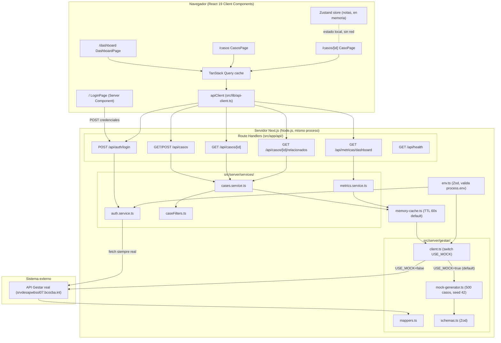

# Auditoría técnica — Dashboard Microinformática BCC

> Documento generado mediante análisis de código en solo lectura. Toda
> afirmación está respaldada por ruta de archivo (y línea cuando aplica).
> Donde no fue posible determinar algo con certeza a partir del código, se
> indica explícitamente como **"no determinado"**.

---

## 1. Resumen ejecutivo

El proyecto es un **dashboard web interno de gestión de incidentes IT** para
el área de Microinformática del Banco de Córdoba (BCC). Consume (o simula)
datos del sistema externo de gestión de servicios **"Gestar"** y los expone
en:

- Un panel de métricas agregadas (KPIs, tendencia mensual, distribución por
  estado/servicio/sucursal) — `src/app/(dashboard)/dashboard/page.tsx`.
- Un listado de casos filtrable y paginado, con detalle de cada caso (página
  completa y modal) — `src/app/(dashboard)/casos/**`.
- Un flujo de creación de casos contra Gestar — `CreateCasePopup` +
  `POST /api/casos`.
- Una pantalla de login contra el sistema Gestar — `src/app/page.tsx` +
  `POST /api/auth/login`.

**Estado real del proyecto** (evidencia, no inferencia): la variable de
entorno `USE_MOCK` (`src/server/env.ts:4`) tiene **default `true`**, y el
`.env` real en disco también la fija en `true`. Esto significa que, salvo
configuración explícita en contrario, **toda la app opera sobre datos
sintéticos generados de forma determinista** por
`src/server/gestar/mock-generator.ts` (500 casos, seed fijo `42`, línea 161),
no sobre el sistema Gestar real. La única excepción es el login
(`src/server/services/auth.service.ts`), que **siempre** golpea el backend
real de Gestar sin importar `USE_MOCK` (ver sección 5).

### Stack tecnológico real (de `package.json`, raíz del repo)

| Categoría | Tecnología | Versión |
|---|---|---|
| Framework fullstack | Next.js (App Router) | `16.2.6` (fija) |
| UI | React / React DOM | `19.2.4` (fijas) |
| Lenguaje | TypeScript | `^5` (strict mode) |
| Estilos | Tailwind CSS | `^4` (vía `@tailwindcss/postcss`) |
| Server state / data fetching | `@tanstack/react-query` | `^5.100.9` |
| Tablas | `@tanstack/react-table` | `^8.21.3` |
| Gráficos | `recharts` | `^3.8.1` |
| Estado global cliente | `zustand` | `^5.0.13` |
| Validación de esquemas | `zod` | `^4.4.3` |
| Fechas | `date-fns` (locale `es`) | `^4.1.0` |
| Iconos | `lucide-react` | `^1.14.0` |
| Utilidades CSS | `clsx`, `tailwind-merge`, `class-variance-authority` | `^2.1.1` / `^3.5.0` / `^0.7.1` |
| Gestor de paquetes | npm | lockfileVersion 3 |

No hay backend separado: el mismo proceso Node.js de Next.js sirve la UI y la
API interna (patrón **BFF — Backend for Frontend**).

---

## 2. Arquitectura general

**Estilo arquitectónico**: monolito fullstack en capas, organizado por
*feature* en el frontend y por responsabilidad técnica en el backend. No es
hexagonal ni microservicios. Next.js App Router actúa como **BFF**: sus Route
Handlers (`src/app/api/**/route.ts`) son la única puerta de entrada HTTP,
delegan la lógica de negocio a `src/server/services/*`, y estos a su vez
delegan el acceso a datos externos a `src/server/gestar/*`.

### Rol del BFF

- **Qué expone**: 6 endpoints REST internos (ver sección 5), consumidos
  exclusivamente por el propio frontend Next.js vía `src/lib/api-client.ts`
  (no hay evidencia de consumidores externos).
- **A qué backend consume**: el sistema "Gestar" (interno del banco), vía dos
  URLs configurables (`GESTAR_API_LOGIN`, `GESTAR_API_CASES`) — o, si
  `USE_MOCK=true`, un generador de datos en memoria que sustituye por completo
  la red.
- **Dónde vive**: handlers en `src/app/api/`, lógica de orquestación en
  `src/server/services/`, integración externa en `src/server/gestar/`.

### Diagrama de arquitectura



---

## 3. Estructura de carpetas

Árbol real verificado contra el sistema de archivos actual (no el de
`Documentacion.md`, que está desactualizado — ver sección 9):

```
src/
├── app/                                  # Next.js App Router
│   ├── page.tsx                          # "/" — Login (Server Component)
│   ├── layout.tsx                        # Layout raíz (fuentes, Providers)
│   ├── (dashboard)/
│   │   ├── layout.tsx                    # Sidebar fijo + slot children
│   │   ├── dashboard/page.tsx            # "/dashboard"
│   │   └── casos/
│   │       ├── page.tsx                  # "/casos" (listado + filtros)
│   │       └── [id]/page.tsx             # "/casos/:id" (detalle)
│   └── api/                              # Route Handlers (BFF)
│       ├── auth/login/route.ts
│       ├── casos/route.ts                # GET (listado), POST (crear)
│       ├── casos/[id]/route.ts
│       ├── casos/[id]/relacionados/route.ts
│       ├── metricas/dashboard/route.ts
│       └── health/route.ts
├── components/
│   ├── providers.tsx                     # QueryClientProvider + devtools
│   ├── layout/                           # Header, Sidebar, Breadcrumbs
│   └── ui/                               # Design system (átomos)
│       ├── badge/, button/, card/, input/, label/, select/, textarea/,
│       │   separator/, tabs/, text/, formField/, Table/, Popup/
│       ├── forms/CreateCaseForm/         # Formulario + schema Zod (ver §9)
│       ├── colorTokens.ts, fontTokens.ts, spacingTokens.ts
│       └── index.ts                      # Barrel único de re-exportación
├── features/                              # Lógica de negocio por dominio
│   ├── auth/        (LoginForm, useLogin)
│   ├── cases/        (componentes detalle/listado, hooks, constants.ts)
│   ├── dashboard/    (KPICards, charts, tablas, useDashboardMetrics)
│   └── notes/        (store Zustand + hook, notas no persistentes)
├── lib/                                    # Utilidades de cliente
│   ├── api-client.ts                      # Único cliente HTTP hacia el BFF
│   ├── query-client.ts                    # Factory de QueryClient
│   ├── formatters.ts                      # Fechas/números (date-fns, es)
│   └── utils.ts                           # cn() = clsx + tailwind-merge
├── server/                                 # Código exclusivo de servidor
│   ├── env.ts                             # Validación Zod de process.env
│   ├── errors.ts                          # AppError / NotFoundError / etc.
│   ├── cache/memory-cache.ts              # Cache in-memory con TTL
│   ├── gestar/                            # client.ts, mappers.ts,
│   │                                       # mock-generator.ts, schemas.ts
│   └── services/                          # cases, metrics, caseFilters, auth
└── types/domain.ts                        # Contratos compartidos cliente/servidor

spec/                                       # Documentos .md de especificación
                                             # de features (no son tests)
Documentacion.md                            # Doc propio del repo, desactualizado
.env / .env.example                         # Config de entorno (ver §8)
```

Responsabilidad de cada carpeta de primer nivel: `app/` = enrutamiento y
endpoints; `components/` = UI reutilizable agnóstica y de layout;
`features/` = lógica de negocio por dominio (UI + hooks); `lib/` = utilidades
de cliente; `server/` = todo lo que no debe llegar al bundle del navegador;
`types/` = modelo de dominio compartido.

---

## 4. Componentes principales

### 4.1 Capa de API (Route Handlers)

| Archivo | Responsabilidad |
|---|---|
| `src/app/api/auth/login/route.ts` | Valida credenciales con Zod y delega en `auth.service.ts`. |
| `src/app/api/casos/route.ts` | `GET`: valida filtros y pagina vía `cases.service.ts`. `POST`: valida payload de creación con `createCaseSchema` y delega en `cases.service.ts`. |
| `src/app/api/casos/[id]/route.ts` | Detalle de un caso por id. |
| `src/app/api/casos/[id]/relacionados/route.ts` | Casos relacionados (misma `slaArea` + `branchOffice`). |
| `src/app/api/metricas/dashboard/route.ts` | Métricas agregadas para el dashboard. |
| `src/app/api/health/route.ts` | Healthcheck trivial, sin dependencias. |

### 4.2 Capa de servicios (`src/server/services/`)

- **`auth.service.ts`** — `login(loginName, password)`: hace `fetch` real a
  `env.GESTAR_API_LOGIN`; si `!res.ok` lanza `UnauthorizedError` (401); si la
  respuesta no trae `token`, lanza `AppError('INVALID_RESPONSE', 502)`.
- **`cases.service.ts`** (`src/server/services/cases.service.ts:1-49`) —
  expone `listCases`, `getCaseById`, `createCase`, `getRelatedCases`. Todas
  pasan por `getCases()` (línea 7-9), que envuelve `getAllCases()` de
  `gestar/client.ts` en `cacheGetOrSet('all_cases', ...)`.
- **`caseFilters.ts`** — 4 predicados puros (`byStatus`, `byPriority`,
  `bySlaArea`, `bySearch`) combinados con `buildPredicates()` y aplicados con
  `Array.every` en `listCases`.
- **`metrics.service.ts`** (líneas 1-99) — `getDashboardMetrics()` calcula
  KPIs, tendencia mensual (`buildMonthlyTrend`, líneas 12-38) y agrupaciones
  por sucursal (`buildGroupStats`, líneas 40-59) sobre el array completo de
  casos, cacheado bajo la clave `'dashboard_metrics'` (línea 62, **distinta**
  de `'all_cases'`).

### 4.3 Integración Gestar (`src/server/gestar/`)

- **`client.ts`** — punto único de entrada: `getAllCases()` y
  `createCaseInGestar()` ramifican según `env.USE_MOCK` (líneas 29, 38) entre
  `mock-generator.ts` y `fetchFromGestar()` (fetch real con Bearer estático,
  líneas 8-26).
- **`mock-generator.ts`** — PRNG `mulberry32` con seed fijo `42` (línea 161),
  genera 500 casos deterministas, cacheados en variable de módulo
  `cachedRawCases` (persisten mientras el proceso Node viva).
- **`mappers.ts`** — `mapGestarCase()` transforma el shape crudo de Gestar
  (campos en mayúsculas, estilo legacy SQL) al modelo de dominio `Case`;
  descarta deliberadamente el campo `DATATYPE` (credenciales en texto plano
  según comentario del propio esquema).
- **`schemas.ts`** — `gestarRawCaseSchema` (shape crudo) y
  `casesFiltersSchema` (filtros de `GET /api/casos`).

### 4.4 Infraestructura (`src/server/`)

- **`memory-cache.ts`** (35 líneas) — `Map` a nivel de módulo, expiración
  lazy por TTL (`cacheGet`/`cacheSet`/`cacheGetOrSet`).
- **`errors.ts`** (29 líneas) — `AppError` base + `NotFoundError` (404),
  `ValidationError` (400, **no usada** en ningún lugar del código revisado),
  `UnauthorizedError` (401).
- **`env.ts`** (34 líneas) — valida `process.env` con Zod al cargar el
  módulo; si falla, lanza y tira abajo el arranque del proceso.

### 4.5 Frontend — design system (`src/components/ui/`)

Átomos agnósticos de dominio: `Badge`, `Button` (ambos con `cva`), `Card`,
`Input`, `Label`, `Select`, `Textarea`, `Separator`, `Tabs` (Context propio,
sin Radix), `Text` (estilos inline con tokens), `Table<T>` (wrapper genérico
de `@tanstack/react-table`), `Popup` (modal genérico con animación), `FormField`
(wrapper de label+error). Re-exportados todos desde `src/components/ui/index.ts`.

### 4.6 Frontend — features

- **`features/auth/`** — `LoginForm.tsx` (Client Component, recibe defaults
  del servidor) + `useLogin.ts` (mutation, guarda token en `sessionStorage`).
- **`features/cases/`** — componentes de listado (`CasesTable/`, `CaseFilters`,
  `SavedViewsTabs`, `CasesStatsBar`), de detalle (`CaseDetailHeader`,
  `CaseBodyLayout`, `CaseTimeline`, `CaseProperties`, `CaseMetricsCard`), modal
  (`CasePopup/`), creación (`CreateCasePopup/`), hooks (`useCases`, `useCase`,
  `useCreateCase`, `useCasesFilters`, `useRelatedCases` — este último sin uso,
  ver §9) y `constants.ts` (diccionarios de variantes de estado/prioridad).
- **`features/dashboard/`** — `KPICards`, `MonthlyTrendChart`,
  `StatusDonutChart`, `CasesByServiceChart`, `CasesByBranchOfficeTable` (estos
  dos últimos son los que realmente se renderizan en `dashboard/page.tsx`;
  `CasesByAreaTable`/`CasesByTypeChart` quedaron huérfanos, ver §9) +
  `useDashboardMetrics`.
- **`features/notes/`** — `store.ts` (Zustand, notas en memoria, sin
  persistencia ni backend) + `hooks.ts` (`useNotes`).

---

## 5. Flujo de peticiones HTTP

### Endpoints detectados

| Método | Path | Handler | Servicio |
|---|---|---|---|
| `POST` | `/api/auth/login` | `src/app/api/auth/login/route.ts` | `auth.service.ts:login` |
| `GET` | `/api/casos` | `src/app/api/casos/route.ts` (función `GET`) | `cases.service.ts:listCases` |
| `POST` | `/api/casos` | `src/app/api/casos/route.ts` (función `POST`) | `cases.service.ts:createCase` |
| `GET` | `/api/casos/[id]` | `src/app/api/casos/[id]/route.ts` | `cases.service.ts:getCaseById` |
| `GET` | `/api/casos/[id]/relacionados` | `src/app/api/casos/[id]/relacionados/route.ts` | `cases.service.ts:getRelatedCases` |
| `GET` | `/api/metricas/dashboard` | `src/app/api/metricas/dashboard/route.ts` | `metrics.service.ts:getDashboardMetrics` |
| `GET` | `/api/health` | `src/app/api/health/route.ts` | (sin servicio, handler trivial) |

### Recorrido completo: `GET /api/casos` (caso representativo)

1. **Entrada** (`src/app/api/casos/route.ts:7-9`): se extraen `searchParams`
   de `req.nextUrl`.
2. **Validación** (líneas 11-18): `casesFiltersSchema.safeParse(...)` valida
   `status`, `priority`, `slaArea`, `busqueda` (strings opcionales) y
   `pagina`/`porPagina` (`z.coerce.number()`, con default 1 y 20
   respectivamente, `porPagina` acotado a `[1,100]`). Si falla → **400** con
   `{ error, detalles: zodError.flatten() }`.
3. **Lógica de negocio** (`listCases`, `cases.service.ts:11-24`): obtiene
   todos los casos vía cache (`'all_cases'`, TTL 60s default), aplica 4
   predicados combinados con `Array.every`, pagina en memoria con
   `slice(start, start+porPagina)`.
4. **Acceso a datos** (`getAllCases`, `gestar/client.ts:28-35`): si
   `USE_MOCK` → genera/reusa 500 casos sintéticos; si no → `fetch` real
   autenticado con Bearer estático contra `GESTAR_API_CASES`.
5. **Respuesta**: `NextResponse.json(result)` con shape `CasesListResponse`
   (`{ casos, total, pagina, porPagina, totalPaginas }`), status 200 implícito.
6. **Errores**: `catch` uniforme — si `err instanceof AppError` responde con
   `err.statusCode`; si no, `console.error` + **500** genérico
   `{ error: 'Error interno del servidor' }`.

Los demás endpoints de casos siguen el mismo patrón estructural (validar →
delegar a servicio → responder → catch uniforme). `POST /api/casos`
(`route.ts:38-57`) difiere en un punto: `await req.json()` **no** está
envuelto en `.catch()` (a diferencia de login), por lo que un body
malformado cae directo al catch genérico y devuelve 500 en lugar de 400.

### Autenticación y autorización

**No existe `middleware.ts`** en el proyecto (ni en raíz ni en `src/`) —
confirmado por búsqueda exhaustiva. Esto tiene consecuencias concretas:

- El login (`POST /api/auth/login` → `auth.service.ts`) siempre hace un
  `fetch` real a `env.GESTAR_API_LOGIN`, **sin** rama mock, y retorna
  `{ token }` si Gestar responde 200 con un campo `token`.
- El cliente guarda ese token con
  `sessionStorage.setItem('gestar_token', token)`
  (`src/features/auth/hooks/useLogin.ts:19`).
- **Ese token nunca se vuelve a leer ni reenviar** en ninguna petición
  posterior: `src/lib/api-client.ts` no agrega ningún header `Authorization`
  ni cookie en `getCases`, `getCase`, `getDashboardMetrics` ni `createCase`.
- **Conclusión verificada por código**: todos los endpoints del BFF excepto
  el propio login son accesibles sin sesión válida — no hay verificación de
  token/cookie en ningún `route.ts`. Esto es consistente con el estado de
  "mockup funcional" declarado en `Documentacion.md`, pero representa un
  hallazgo de seguridad relevante si el proyecto avanza a producción.
- Las llamadas servidor→Gestar para leer/crear casos usan un
  `GESTAR_API_TOKEN` **estático de entorno** (`gestar/client.ts:14,48`), no
  relacionado con la sesión del usuario logueado.

### Manejo de errores

Jerarquía simple en `src/server/errors.ts` (`AppError` base +
`NotFoundError`/`ValidationError`/`UnauthorizedError`). Los 6 route handlers
(salvo `health`) replican el mismo bloque `try/catch`: `AppError` propaga su
`statusCode`/`message`; cualquier otro error (incluidos los `Error` planos
lanzados desde `gestar/client.ts` cuando faltan envs o Gestar responde con
error HTTP) **siempre** colapsa a `500` genérico, perdiendo la semántica real
del error (un 401/404 de Gestar nunca llega como tal al cliente final).

---

## 6. Dependencias

### Producción — rol de cada una

| Paquete | Rol concreto en este proyecto |
|---|---|
| `next` | Framework, App Router, Route Handlers (BFF), fetch Data Cache. |
| `react` / `react-dom` | Render de UI; uso de `use(params)` (API React 19) en `casos/[id]/page.tsx`. |
| `@tanstack/react-query` | Único mecanismo de "server state" (cache/stale/loading) en el cliente. |
| `@tanstack/react-table` | Motor de columnas/orden de `Table<T>`, usado por `CasesTable` y `CasesByBranchOfficeTable`. |
| `recharts` | Gráficos: línea (tendencia mensual), dona (estado), barras (servicio). |
| `zustand` | Único store global: notas de casos (en memoria, sin persistencia). |
| `zod` | Validación en los 3 bordes: env vars, query params de filtros, body de creación de casos. |
| `date-fns` (+ locale `es`) | Formateo de fechas y agrupación mensual de métricas. |
| `lucide-react` | Iconografía. |
| `clsx` + `tailwind-merge` | Helper `cn()` para componer clases sin colisiones. |
| `class-variance-authority` | Variantes tipadas de `Badge`/`Button`. |

### Desarrollo

`@tailwindcss/postcss`, `@tanstack/react-query-devtools`, `@types/*`,
`eslint` (`^9`) + `eslint-config-next` (flat config, sin reglas custom),
`tailwindcss`, `typescript`.

### Acoplamientos internos fuertes

- `src/lib/api-client.ts` es el **único** punto de entrada HTTP del cliente
  hacia el BFF, salvo una excepción: `useRelatedCases.ts` hace un `fetch`
  inline propio en lugar de usar `apiClient` (inconsistencia, ver §9).
- `src/server/services/*` dependen unidireccionalmente de
  `src/server/gestar/client.ts`; éste es el único módulo que conoce la
  existencia de `USE_MOCK`.
- `src/types/domain.ts` es el contrato compartido entre servidor y cliente;
  cualquier cambio de forma de `Case`/`DashboardMetrics` impacta mappers,
  servicios y prácticamente todos los componentes de `features/*`.

### Observaciones sobre versiones

- No se detectaron duplicidades funcionales (una sola librería de fechas, una
  de estado, una de tablas, una de gráficos, sin cliente HTTP de terceros —
  todo vía `fetch` nativo).
- Versiones a verificar manualmente por ser atípicas: `lucide-react: ^1.14.0`
  (las versiones públicas históricas de esta librería eran 0.x — confirmar
  que no sea una resolución inesperada de major) y `next: 16.2.6` /
  `react: 19.2.4` (muy recientes; confirmar que sean releases estables, no
  canary, antes de desplegar a producción). **No determinado** sin ejecutar
  `npm audit`/`npm outdated` si existen CVEs específicas — no se ejecutó por
  estar fuera del alcance de solo lectura de esta auditoría.

---

## 7. Manejo de datos y estado

### Modelo de dominio (`src/types/domain.ts`, 94 líneas)

- `Case` (campos 1-38): entidad central, con campos derivados explícitos
  (`resolutionHours`, `isClosed`) calculados en `mappers.ts`, no provistos
  por Gestar directamente.
- `DashboardMetrics`, `MonthlyData`, `StatusCount`, `TypeCount`, `AreaStats`:
  formas de salida de `metrics.service.ts`.
- `CasesListResponse`, `CasesFilters`: contrato de `GET /api/casos`.

### Persistencia

**No hay base de datos propia.** La fuente de verdad es el sistema externo
Gestar (cuando `USE_MOCK=false`) o un generador determinista en memoria
(cuando `USE_MOCK=true`, el caso por defecto). No hay ORM, no hay migraciones,
no hay esquema SQL en el repo.

### Cache

Dos cachés independientes y desacopladas, ambas en `src/server/cache/memory-cache.ts`
(`Map` a nivel de proceso, sin compartir entre instancias, se pierde en cada
reinicio):
- Clave `'all_cases'` (usada por `cases.service.ts`).
- Clave `'dashboard_metrics'` (usada por `metrics.service.ts`, que internamente
  vuelve a llamar a `getAllCases()` de forma independiente).

Ambas con TTL default `CACHE_TTL_MS=60000` (60s). **No hay invalidación
explícita** al crear un caso: `createCase` → `createCaseInGestar` no toca
ninguna entrada de cache, por lo que un caso recién creado no aparecerá en
`GET /api/casos` ni en las métricas hasta que el TTL expire naturalmente. La
invalidación que sí ocurre (`useCreateCase.ts:13`,
`queryClient.invalidateQueries({ queryKey: ['casos'] })`) es **solo
client-side** (TanStack Query) y dispara un refetch que igualmente puede
devolver datos cacheados en el servidor si el TTL no expiró.

### Estado en el cliente

- **TanStack Query** — cache de "server state" para `casos`, `casos/:id`,
  `metricas/dashboard` (y `useRelatedCases`, sin consumidores). `staleTime`
  30-60s según hook, `retry: 1` configurado globalmente en
  `src/lib/query-client.ts`.
- **Zustand** — único store, `features/notes/store.ts` (17-34): notas
  efímeras en memoria del navegador, sin middleware `persist`, sin backend
  (no existe ningún endpoint `/api/.../notas`). Se pierden al recargar la
  página.
- **`sessionStorage`** — solo se usa para guardar (no leer) el token de login
  (ver §5).

---

## 8. Configuración y entorno

### Variables de entorno (`src/server/env.ts`, validadas con Zod)

| Variable | Esquema Zod | Default | Uso |
|---|---|---|---|
| `USE_MOCK` | `z.coerce.boolean()` | `true` | Interruptor global mock/real en `gestar/client.ts`. |
| `GESTAR_API_LOGIN` | `z.string().url().optional()` | — | URL de login real, usada siempre (no respeta `USE_MOCK`). |
| `GESTAR_API_CASES` | `z.string().url().optional()` | — | URL de lectura/creación de casos en Gestar real. |
| `GESTAR_API_TOKEN` | `z.string().optional()` | — | Bearer estático de servidor para llamadas a Gestar. |
| `LOGIN_NAME` | `z.string().optional()` | — | Precarga el formulario de login (ver riesgo abajo). |
| `PASSWORD` | `z.string().optional()` | — | Idem, precarga de contraseña. |
| `CACHE_TTL_MS` | `z.coerce.number()` | `60000` | TTL del cache en memoria. |

Si la validación Zod falla, `validateEnv()` lanza y **tira abajo el arranque
del proceso** (`env.ts:25-28`).

### Hallazgos de configuración/seguridad

1. **`.env` real en disco contiene credenciales en texto plano**
   (`LOGIN_NAME=api650`, `PASSWORD=gestar650`) y una URL de servidor interno
   del banco (`srvdesapwbssl07.bcocba.int`). Está excluido por `.gitignore`
   (línea con `.env*`), pero reside sin cifrar en el filesystem local.
2. **Discrepancia de nombre de variable**: `.env.example` usa `USE_MOCKS`
   (con "S"), pero el código (`env.ts` y todo el proyecto) usa `USE_MOCK`
   (sin "S"). Si se configura un `.env` siguiendo literalmente la plantilla,
   la app defaultea silenciosamente a modo mock sin avisar.
3. **Exposición de credenciales por defecto en el cliente**:
   `src/app/page.tsx` (Server Component) lee `env.LOGIN_NAME`/`env.PASSWORD`
   y los pasa como props a `LoginForm` (Client Component). Esto los incluye
   en el payload RSC serializado que llega al navegador — visibles en
   HTML/devtools sin necesidad de autenticarse.
4. **Scripts no cross-platform**: `dev`/`start` usan sintaxis
   `set VAR=valor&&` propia de `cmd.exe` (`package.json:6,8`), lo cual falla
   en macOS/Linux sin una herramienta como `cross-env`.

### Build, despliegue, CI/CD

- No existe `Dockerfile`, `docker-compose.yml`, ni carpeta `.github/` (sin
  pipelines de CI/CD versionados).
- No hay `vercel.json` ni configuración de despliegue explícita; `next.config.ts`
  es el boilerplate por defecto sin personalizar (`output`, `images`,
  `redirects`, etc. — todo ausente).
- Scripts disponibles: `dev`, `build`, `start`, `lint`. **No hay script
  `test`.**

---

## 9. Calidad de código y observaciones

### Patrones bien aplicados

- **Feature-based architecture** consistente: `components/ui` (agnóstico)
  vs. `features/*` (negocio) vs. `server/*` (solo servidor) — separación
  respetada en casi todo el árbol.
- **Tipado estricto**: cero usos de `any` en todo `src/` (confirmado por
  búsqueda exhaustiva); la única excepción es una escotilla documentada con
  `eslint-disable-next-line` en `Table.types.ts` para `ColumnDef<T, any>`.
- **Validación en los bordes** con Zod: variables de entorno, query params,
  body de creación de casos.
- **`cva` + `cn()`** para variantes de componentes (`Badge`, `Button`) —
  patrón estándar y bien aplicado donde se usa.
- **Jerarquía de errores tipada** (`AppError` y subclases) bien usada en los
  servicios (aunque `ValidationError` quedó sin consumidores).
- **`Table<T>` genérico** reutilizado correctamente por dos features
  distintas (`CasesTable`, `CasesByBranchOfficeTable`) sin duplicar lógica de
  tabla.

### Code smells y deuda técnica detectada

1. **Componentes/hooks huérfanos (código muerto)**, confirmados por ausencia
   total de importadores:
   - `src/features/cases/components/CaseRequester.tsx`
   - `src/features/cases/components/CaseInfoTabs.tsx`
   - `src/features/cases/hooks/useRelatedCases.ts` — pese a que el endpoint
     backend `GET /api/casos/[id]/relacionados` sí está implementado y
     funcional.
   - `src/features/dashboard/components/CasesByAreaTable/` y
     `CasesByTypeChart/` — no exportados en `dashboard/components/index.ts`,
     reemplazados por `CasesByBranchOfficeTable`/`CasesByServiceChart`.
   - `src/components/layout/Breadcrumbs/` — exportado pero sin consumidores;
     cada página implementa su propio breadcrumb inline en su lugar.
2. **Duplicación de código real** entre `CaseDetailHeader.tsx` y
   `CasePopup/CasePopupHeader.tsx`: función `initials()` copiada
   literalmente, `elapsedLabel()` casi idéntica, mismo banner de SLA. Candidato
   claro a extraer un componente compartido parametrizado por `variant`.
3. **Inconsistencia en la capa de datos**: `useRelatedCases.ts` hace `fetch`
   inline en vez de extender `apiClient` (`src/lib/api-client.ts`), rompiendo
   el único punto centralizado de acceso HTTP que respeta el resto del
   proyecto.
4. **Selector de Zustand no optimizado**: `useNotes` (`features/notes/hooks.ts`)
   selecciona el array completo de notas y filtra en cada render, ignorando
   el método `getNotesByCaseId` ya implementado en el propio store.
5. **Diccionarios de estado duplicados conceptualmente**: `StatusDonutChart.tsx`
   define su propio mapa de colores por estado, paralelo (pero con valores
   distintos) al de `features/cases/constants.ts` — riesgo de divergencia si
   se agrega un nuevo estado.
6. **Migración a "carpeta por componente" incompleta**: dentro de
   `features/cases/components/` coexisten archivos sueltos
   (`CaseProperties.tsx`, `CaseTimeline.tsx`, etc.) con subcarpetas
   (`CasePopup/`, `CreateCasePopup/`, `CasesTable/`); esta última además
   mantiene un archivo-puente de re-export (`CasesTable.tsx` →
   `CasesTable/CasesTable.tsx`) sin equivalente en el resto.
7. **Mezcla de paradigmas de estilado** en el design system: `Button`/`Badge`
   usan `cva`+Tailwind, pero `Text`/`Separator`/`Card` usan estilos inline con
   enums de tokens (`fontTokens.ts`, `colorTokens.ts`, `spacingTokens.ts`) —
   dos sistemas de theming convivendo sin un estándar documentado.
8. **`CreateCaseForm` ubicado fuera de lugar**: vive en
   `src/components/ui/forms/` (pensado como design system agnóstico) pero
   está fuertemente acoplado al dominio bancario (tipos `SucursalCid`,
   `CausaRaiz`, catálogos hardcodeados de sucursales/servicios reales del
   banco en `CreateCaseForm.constants.ts`). Sería más coherente en
   `features/cases/components/`.
9. **Catálogos de formulario hardcodeados**: las opciones de sucursal,
   servicio, causa raíz y gerencia del formulario de creación de casos son
   constantes estáticas en código, no provienen de ningún endpoint —
   sugiere que la integración de catálogos reales con Gestar aún no existe.
10. **Sin mapeo inverso dominio→Gestar**: `createCase` reenvía el payload
    validado (campos en español, anidados) directo a `createCaseInGestar`,
    que lo serializa tal cual — no hay certeza de que ese sea el formato
    exacto que espera la API real de Gestar para creación (**no
    determinado** sin documentación del endpoint real).
11. **`Documentacion.md` propio del repo está desactualizado**: no menciona
    el feature de autenticación, `CreateCaseForm`, ni la reorganización de
    `components/ui` en subcarpetas — debe tratarse como contexto histórico,
    no como fuente de verdad para optimizaciones futuras.

### Cobertura de tests

**No existe testing automatizado de ningún tipo** en el proyecto:
- No hay framework de testing en `package.json` (`jest`, `vitest`,
  `@testing-library/react`, `playwright`, `cypress` — ninguno presente).
- No hay script `test`.
- No hay archivos `*.test.*`/`*.spec.*` ni carpetas `__tests__` en `src/`.
- La carpeta `spec/` contiene únicamente documentos markdown de
  especificación funcional de features, no pruebas ejecutables.

**Qué quedaría por testear** (priorizado por riesgo de regresión silenciosa):
- `src/server/services/caseFilters.ts` — predicados puros, fáciles de testear
  unitariamente, con alto valor (son la lógica de filtrado de toda la app).
- `src/server/gestar/mappers.ts` — transformación crítica de datos crudos a
  dominio; el determinismo de `mock-generator.ts` (seed fija) lo hace ideal
  para snapshot testing.
- `src/server/services/metrics.service.ts` — cálculos de agregados
  (`buildMonthlyTrend`, `buildGroupStats`) con lógica de fechas no trivial.
- Los 6 route handlers — al menos tests de contrato (status code, shape de
  respuesta, manejo de 400/404/500).
- `src/components/ui/forms/CreateCaseForm/CreateCaseForm.schema.ts` —
  validación de reglas de negocio del formulario.

---

## 10. Oportunidades de mejora (priorizadas)

| # | Descripción | Archivo(s) | Impacto | Esfuerzo |
|---|---|---|---|---|
| 1 | Definir e implementar autenticación/autorización real en el BFF (middleware o guard por endpoint), o documentar explícitamente que es intencional para esta fase de mockup. | Todo `src/app/api/**` (falta `middleware.ts`) | **Alto** | **Alto** |
| 2 | Eliminar o conectar código muerto: `useRelatedCases`, `CaseRequester`, `CaseInfoTabs`, `CasesByAreaTable`, `CasesByTypeChart`, `Breadcrumbs`. | Archivos listados en §9.1 | Medio | **Bajo** |
| 3 | Quitar la inyección de `LOGIN_NAME`/`PASSWORD` por defecto en el HTML del cliente, o moverla detrás de una bandera de entorno explícita de "solo desarrollo". | `src/app/page.tsx` | **Alto** (seguridad) | **Bajo** |
| 4 | Invalidar la cache de servidor (`memory-cache`) tras `POST /api/casos`, o reducir su TTL para ese caso de uso. | `src/server/services/cases.service.ts`, `memory-cache.ts` | Medio | Bajo |
| 5 | Unificar `CaseDetailHeader` y `CasePopupHeader` en un único componente parametrizado por `variant: 'page' | 'popup'`. | `CaseDetailHeader.tsx`, `CasePopup/CasePopupHeader.tsx` | Medio | Medio |
| 6 | Corregir `.env.example` (`USE_MOCKS` → `USE_MOCK`) para evitar configuraciones silenciosamente erróneas. | `.env.example` | Medio | **Bajo** |
| 7 | Envolver `await req.json()` en `.catch()` en `POST /api/casos` (paridad con login) para devolver 400 en vez de 500 ante body malformado. | `src/app/api/casos/route.ts:40` | Bajo | **Bajo** |
| 8 | Usar `ValidationError` ya definida en lugar de construir manualmente cada respuesta 400, y mapear errores planos de `gestar/client.ts` a `AppError` con status code semántico (401/404/502 reales en vez de 500 genérico). | `src/server/errors.ts`, `src/server/gestar/client.ts`, todos los `route.ts` | Medio | Medio |
| 9 | Mover `CreateCaseForm` (y su schema/constants) de `components/ui/forms/` a `features/cases/components/CreateCaseForm/`, ya que está acoplado al dominio bancario. | `src/components/ui/forms/CreateCaseForm/**` | Bajo | Medio |
| 10 | Unificar la fuente de verdad de "estados de caso" (un solo diccionario de labels/colores reutilizado por `StatusDonutChart` y `features/cases/constants.ts`). | `StatusDonutChart.tsx`, `features/cases/constants.ts` | Bajo | Bajo |
| 11 | Introducir testing mínimo: predicados de filtrado, mappers de Gestar, y contrato de los route handlers. | `caseFilters.ts`, `mappers.ts`, `route.ts` (todos) | **Alto** (riesgo de regresión) | Medio |
| 12 | Completar la migración a "carpeta por componente" en `features/cases/components/` (o revertirla explícitamente), eliminando el archivo-puente residual de `CasesTable.tsx`. | `features/cases/components/**` | Bajo | Bajo |
| 13 | Reemplazar `set VAR=valor&&` (sintaxis cmd.exe) en los scripts `dev`/`start` por una solución cross-platform (`cross-env`) si el proyecto debe ejecutarse fuera de Windows. | `package.json:6,8` | Bajo | Bajo |

---

## Alcance y limitaciones de este documento

- Cobertura: se revisó el 100% de los archivos `.ts`/`.tsx` listados por
  `Glob` en `src/`, además de toda la configuración de raíz
  (`package.json`, `tsconfig.json`, `next.config.ts`, `eslint.config.mjs`,
  `postcss.config.mjs`, `.env`, `.env.example`, `.gitignore`).
- No se ejecutó `npm audit`/`npm outdated` (acción de red, fuera del alcance
  de solo lectura solicitado) — pendiente para confirmar CVEs específicas.
- No se pudo determinar el formato exacto que espera la API real de Gestar
  para `POST` de creación de casos (no hay documentación del endpoint real
  en el repo, solo el mock) — marcado explícitamente como "no determinado"
  en §9.
- No se ejecutó la aplicación (`npm run dev`) ni se realizaron pruebas
  manuales en navegador; todas las afirmaciones provienen de lectura estática
  de código.
